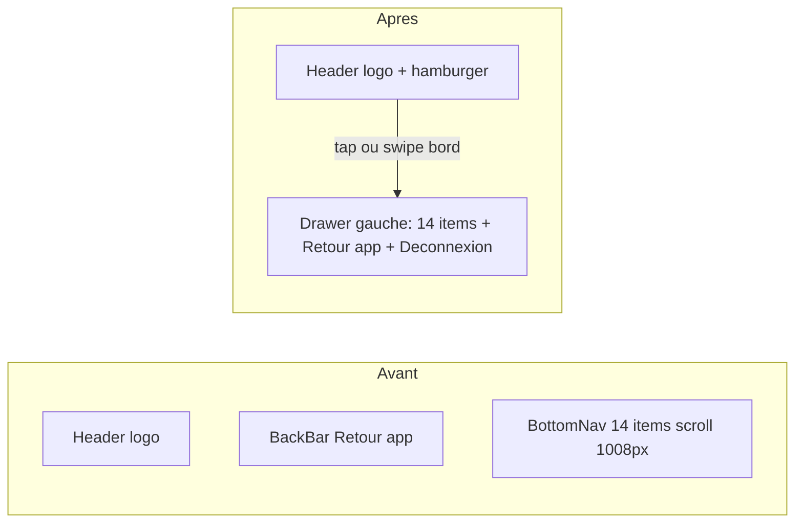

# Backoffice mobile — refonte complète

## Décisions actées

- **Navigation** : hamburger dans le header ouvrant un drawer latéral gauche. La bottom nav du backoffice **disparaît**.
- **`AdminShell` est partagé avec la mairie** (5 items visibles vs 14 au backoffice). J'ajoute une prop `mobileNav?: "bottom" | "drawer"` (défaut `"bottom"`) : seul le backoffice passe `"drawer"`. La mairie reste en bottom nav, qui est le bon pattern à 5 items.
- **Header** : logo + hamburger uniquement. Le drawer contient la nav, « Retour à l'app » et « Se déconnecter ». Pas d'avatar séparé.
- **Emails** : on garde le HTML brut, on rend l'édition mobile réellement praticable (insertion de variables et de blocs au curseur, police 16px, aperçu plein écran).
- **Détail commune** : 3 onglets `Abonnement | Adhérents | Réglages`. Le 3e accueille les deux sections aujourd'hui orphelines (Mode essai, Message de bienvenue) — à confirmer à la revue.

## Trade-off assumé

Un hamburger en haut sort de la zone du pouce, contrairement à une bottom nav. C'est acceptable ici : la bottom nav actuelle a un `scrollWidth` de 1008px pour 375px visibles, donc **9 des 14 entrées sont invisibles** sans scroll latéral et sans affordance. Mitigation : `Drawer.SwipeArea` permet d'ouvrir le drawer par un swipe depuis le bord gauche.



---

## Lot 0 — Fondations partagées

À faire d'abord : tout le reste en dépend.

- **`components/ui/tabs.tsx`** — `npx shadcn@latest add tabs` (absent du projet). Réaligner sur les tokens (`bg-soft-pink`, `text-coral`, `rounded-sm`, `cursor-pointer`) : la sortie brute shadcn utilise `bg-popover` / `text-muted-foreground`.
- **`components/ui/filter-sheet.tsx`** (nouveau) — extraire `FilterSheetTrigger` (bouton à badge de compteur), `FilterSection`, `FilterRow`, `CheckGlyph`. Ces primitives sont **déjà copiées-collées dans 5 fichiers** (`report-list-toolbar.tsx` 299-386, `habitants-list-toolbar.tsx` 535-615, `announcement-list-toolbar.tsx`, `event-list-toolbar.tsx`, `initiative-list-toolbar.tsx`). Le trigger stylé existe en modèle ici :

```169:190:components/features/reports/report-list-toolbar.tsx
      <PopoverTrigger
        render={
          <button
            type="button"
            className={cn(
              "relative inline-flex cursor-pointer items-center gap-1.5 rounded-sm border bg-surface px-2.5 py-1.5 text-xs font-semibold transition hover:border-purple/30 max-md:py-2.5 md:py-1.5",
```

Le conteneur : `Modal` sur mobile (déjà un bottom sheet, `rounded-t-3xl` + `useVisualViewportBottomSheet`), `Popover` sur desktop.

- **Cibles tactiles** — `Input` et `SelectTrigger` sont en `h-8` (32px), `Button size="xs"` en `h-6` (24px) : **aucun contrôle de toolbar n'atteint 44px**. Ajouter un palier mobile (`h-11 md:h-8`) dans `components/ui/form-field.tsx`, `select.tsx` et `button.tsx` plutôt que du `max-md:` dispersé dans les features.
- **`components/ui/page-heading.tsx`** — `<h1>` figé à `text-[28px] leading-9` : ajouter `text-2xl md:text-[28px]`, et `flex-wrap` sur la ligne titre/actions (aujourd'hui `justify-between` + `shrink-0` écrase le titre).
- **`<Toaster />` manquant** — il n'est monté que dans les layouts `(resident)`, `(banned)`, `(suspended)`. Conséquence : `delete-user-account-button.tsx` (l. 43, 50) appelle `toast.error` / `toast.success` **dans le vide** — une suppression de compte irréversible se fait sans confirmation ni message d'erreur. Monter `<Toaster position="top-center" richColors closeButton />` dans `app/(backoffice)/layout.tsx` et `app/(municipality)/layout.tsx`.

## Lot 1 — Navigation par drawer

- **`components/features/admin-shell/admin-mobile-drawer.tsx`** — basé sur `Drawer` de `@base-ui/react/drawer`. **Anatomie Base UI obligatoire** (sinon warning console et swipe/scroll lock désactivés) :

```tsx
<Drawer.Root swipeDirection="left">
  <Drawer.Trigger />
  <Drawer.SwipeArea className="fixed inset-y-0 left-0 w-4 md:hidden" />
  <Drawer.Portal>
    <Drawer.Backdrop />
    <Drawer.Viewport className="fixed inset-y-0 left-0">
      <Drawer.Popup className="flex h-full w-72 flex-col bg-surface …">
        <Drawer.Content className="flex min-h-0 flex-1 flex-col">
          {/* nav + Retour à l'app + Déconnexion */}
        </Drawer.Content>
      </Drawer.Popup>
    </Drawer.Viewport>
  </Drawer.Portal>
</Drawer.Root>
```

  - **`Drawer.Viewport`** : conteneur de positionnement requis autour de `Popup` — ne pas omettre.
  - **`Drawer.Content`** : recommandé pour permettre la sélection de texte sans interférer avec le swipe.
  - Pas de prop `side` : l'ancrage se fait en CSS sur `Viewport` + `Popup` (`fixed inset-y-0 left-0`).
  - `swipeDirection="left"` = geste de fermeture ; `SwipeArea` = ouverture au bord gauche (placer **avant** `Portal`, sibling du `Trigger`).
  - Contenu : 14 items (icône + libellé, badge signalements), section `border-t` avec « Retour à l'app » et « Se déconnecter » via `<form action={signOut}>`.
  - **Bug actuel (l. 85-87)** : `Popup` est directement dans `Portal` sans `Viewport` → corriger en enveloppant comme ci-dessus.
- **`admin-header.tsx`** — ajouter le hamburger à droite, rendu conditionnellement (`mobileNav === "drawer"`), cible 44px, `md:hidden`.
- **`admin-shell.tsx`** — prop `mobileNav`, et en mode drawer : ne plus rendre `AdminMobileBackBar` ni `AdminMobileBottomNav`, et passer `pb-28` → `pb-6` sur le `<main>`.
- **`admin-nav.tsx`** — `AdminMobileBottomNav` et `AdminMobileBackBar` restent en place pour la mairie.

Bénéfice collatéral : `email-template-editor.tsx:240` pose sa barre de sauvegarde à `bottom-[calc(60px+...)]` alors que la nav mesure **72px** (libellés sur 2 lignes + `items-stretch`), avec `z-50` contre `z-[1100]` — donc 12px de la barre passent sous la nav. Le drawer supprime le problème à la racine ; la barre repasse en `bottom-0`.

## Lot 2 — Filtres en panneau dépliable

Contrat déjà uniforme partout : `params` typé + `navigate(Partial<Params>)`, état 100 % dans l'URL, application immédiate sans bouton « Appliquer ». **Rien à réécrire côté navigation** : le sheet reçoit ces deux choses et reste agnostique.

**Principe clé : les filtres existent sur desktop ET mobile. Seule la présentation change.**
- **Desktop (>= md)** : contrôles inline (Select, Popover multi-select) — layout actuel étendu avec les nouveaux filtres abonnement/paiement.
- **Mobile (< md)** : tous les filtres sont masqués derrière un bouton icône (`SlidersHorizontal`) à droite de la recherche. Au tap, un bottom sheet (`Modal`) s'ouvre avec les `FilterSection` / `FilterRow`.

### Composant partagé `components/ui/filter-sheet.tsx` (nouveau)

Extraire de `report-list-toolbar.tsx` (l. 299-386) : `FilterSheet`, `FilterSheetTrigger`, `FilterSection`, `FilterRow`, `CheckGlyph`. Le trigger est `md:hidden`, le contenu du sheet utilise `Modal` (déjà bottom sheet mobile). Pastille compteur `bg-purple` sur le bouton si filtres actifs > 0.

### Pour `/backoffice/communes` : ajout des filtres abonnement/paiement

Ceux-ci sont des **filtres métier supplémentaires** (pas liés au redesign mobile) :
- **Abonnement** : Tous / Avec abonnement actif / Sans abonnement actif
- **Paiement** : Tous / Payé / Impayé (visible uniquement quand abonnement = "avec")

Données : batch-fetch sur `commune_subscriptions` (`starts_at <= today AND ends_at >= today`), post-filtrage acceptable vu le volume faible de communes pilotées. Ajout des params `subscription` et `payment` dans `lib/utils/backoffice-search-params.ts`.

Sur **desktop** : 2 nouveaux `Select` en ligne à côté du filtre statut existant.
Sur **mobile** : 2 nouvelles `FilterSection` dans le bottom sheet.

### Compteur de filtres actifs

- Ajouter `activeXxxFilterCount(params)` dans chaque `lib/utils/*-params.ts` (là où vivent déjà les défauts), sur le modèle de `activeReportFilterCount` (`lib/utils/report-list-params.ts:160-178`). Les builders omettent déjà les valeurs par défaut de l'URL, ce qui rend le comptage fiable. Ignorer `page` et `limit`.

### Migration des 4 toolbars

- Migrer les 4 toolbars : `contenus-toolbar.tsx` (**jusqu'à 9 contrôles, > 320px de filtres avant le premier résultat**), `audit-log-toolbar.tsx`, `invitations-toolbar.tsx`, `backoffice-list-toolbar.tsx`.
- Hors du sheet, toujours visibles : la recherche texte (debounce 300ms existant) et le trigger « Filtres (N) ».
- Pied de sheet (slot `footer` de `Modal`) : « Tout effacer » + « Fermer ».
- Préserver la sémantique existante des multi-selects : cocher = cumul (panneau ouvert), cliquer la ligne = sélection unique (panneau fermé). Elle est documentée par `FilterHelpPopover`.
- Porter les deux dépendances dynamiques de `contenus` : les sections `subtype` et `official` n'existent que selon `params.types`.
- **Bug à corriger, pas à propager** : `navigateStatuses` ignore `queryVariant`, code en dur le builder communes et perd `role` / `status` :

```196:208:components/features/backoffice/backoffice-list-toolbar.tsx
  function navigateStatuses(nextStatuses: AccessStatus[]) {
    setLocalStatuses(nextStatuses);
    startStatusTransition(() => {
      router.push(
        `${pathname}${buildBackofficeCommunesListQuery({
```

## Lot 3 — `/backoffice/communes/[id]`

Aujourd'hui : 7 cartes de stats **toutes empilées sous 640px** (`sm:grid-cols-2` + `sm:grid-cols-3`), puis 5 sections à la suite.

- **Stats** : fusionner les deux grilles en `grid-cols-2 sm:grid-cols-2 lg:grid-cols-4`. Conserver la distinction visuelle actuelle (4 métriques « actives » colorées en `text-3xl`, 3 métriques « créées » en `text-2xl text-text`), mais réduire la valeur à `text-2xl` sur mobile pour tenir en 2 colonnes. Passer les libellés de `text-[10px]` à `text-[11px]`.
- **Onglets** sous les stats : `Abonnement | Adhérents | Réglages`.
- **État d'onglet en `useState` client**, pas en URL : `buildBackofficeMembersListQuery` ne reconstruit que `q / role / status / page / limit`, donc un `?tab=` serait effacé au premier changement de filtre. Perdre le deep-link est acceptable pour un backoffice ; l'alternative (étendre parse + build) est plus coûteuse.
- Les panneaux **restent rendus côté serveur** et sont passés en `children` au wrapper client d'onglets. La page charge déjà stats, membres et abonnement en parallèle : le coût de fetch ne change pas.
- **Table abonnement** : `overflow-x-auto` est inopérant car `table w-full` comprime les 7 colonnes. Sur mobile, rendre une liste de cartes (`Début → Fin`, montant en tête, badges paiement/résiliation, actions en pied) ; garder la table en `md:` avec `min-w-max`. Même traitement pour `components/features/municipality/subscription-periods-table.tsx`.
- **Adhérents** : préserver le fait que `ChangeRoleButton` est hors du `<Link>` (pas d'interactif imbriqué). Exploiter `suspendedAt` / `suspendedReason`, déjà remontés par la requête mais ignorés par `MembershipStatusBadge`.
- **Réglages** : envelopper `CommuneWelcomeMessageEditor` dans une `section` + `h2` + `Card` (aujourd'hui un `div.space-y-3` nu, sans titre).

## Lot 4 — Éditeur de templates email

Objectif : tout faire depuis le téléphone, en gardant le HTML brut.

- **Insertion au curseur, pas copie.** `email-template-variables-popover.tsx` copie la variable dans le presse-papier (l. 62-70) — coller au bon endroit dans un textarea au doigt est le pire moment de l'écran. Ajouter un `ref` sur le textarea et insérer à `selectionStart`.
- **Barre de snippets** au-dessus du champ (scroll horizontal) : blocs HTML prêts à l'emploi (paragraphe, titre, bouton CTA au dégradé de la charte, séparateur, lien). C'est ce qui rend l'édition HTML réellement faisable au doigt.
- **Textarea** : `text-base` (16px) minimum — 12px déclenche le zoom iOS ; `spellCheck={false}`, `autoCapitalize="off"`, `autoCorrect="off"`, `autoComplete="off"` (aujourd'hui le clavier capitalise et autocorrige les balises) ; hauteur en `dvh` au lieu de `rows={24}`.
- **Aperçu** : remplacer `h-[600px]` figé par une hauteur fluide ; ajouter un basculement largeur mobile / desktop (à 335px de large, impossible de vérifier le rendu desktop d'un email en `max-width: 600px`) ; **afficher aussi le sujet rendu** — il accepte des variables (`{{sender_name}} vous invite...`) et n'est jamais prévisualisé.
- **Feedback** : `toast.success` / `toast.error` (dépend du Lot 0). Aujourd'hui l'enregistrement est totalement silencieux et l'erreur s'affiche sous le textarea, hors écran sur mobile.
- **Sanitisation** : le serveur enregistre `sanitizeEmailHtml(bodyHtml)` mais le client garde la version non sanitisée dans son state `saved*` — `hasChanges` repasse à `false` alors que le contenu réel diverge. Retourner le HTML sanitisé depuis `updateEmailTemplate` (`lib/actions/platform.ts:507-549`) et resynchroniser.
- **Garde-fou** : `beforeunload` + confirmation sur `HistoryBackLink` quand `hasChanges` (aucune protection aujourd'hui).
- **Design system** : remplacer les `<input>`, `<textarea>` et `<label>` bruts (l. 165-177, 212-218) par `FormField` / `Input` / `Textarea`, les onglets maison (l. 183-207) par le nouveau `Tabs`, et `bg-white` (l. 220) par `bg-surface`.

## Lot 5 — Éditeur de documents juridiques

Le `.ProseMirror` mesure **12 402px** de haut sur les CGU (`min-h-[420px]` sans `max-height`).

- **Toolbar `sticky`** : elle est `static` aujourd'hui, donc invisible dès qu'on descend — impossible de mettre en gras un paragraphe au milieu du document sans remonter de milliers de pixels.
- **Barre d'action fixe** pour « Enregistrer », actuellement à 12 910px du haut. Reprendre le portal de l'éditeur email.
- `ToolbarButton` en `size-8` avec `gap-2` : passer à 44px sur mobile.
- Remplacer les `<button>` et `<input>` bruts (l. 39-61, 146) par les composants du design system.
- Ajouter les boutons manquants pour les marks déjà actifs dans `StarterKit` mais sans commande (link, underline, strike, blockquote, `horizontalRule`) : atteignables au collage, impossibles à retirer.

## Lot 6 — Correctifs mobiles page par page

- **Débordements horizontaux** : `audit` (bloc device + IP en `ml-auto shrink-0`, ~310px insécables) ; `signalements` (`shrink-0` sur « Signalé par {nom}, le {date} ») ; `assistance` (`LinkifiedText` en `whitespace-pre-wrap` sans `break-words`) ; `leads` et `invitations` (emails en titre sans `truncate` / `break-all`).
- **Cibles tactiles restantes** : `audit` — « Voir le détail » est un `Button h-auto px-0 py-0 text-xs`, soit ~16px, la plus petite du backoffice ; `signalements` — `ReportRestoreActionsClient` est resté en `size="xs"` (24px) alors que `ReportActionsClient` a déjà son palier `max-md:` ; `categories` et `communication` — boutons Modifier/Supprimer en `size-8` séparés de `gap-1`, risque de mis-tap sur une action destructive.
- **`users/[id]`** : `whitespace-nowrap` + libellés longs (« Suspendre de toutes les communes ») produisent 3 rangées pleine largeur avant les stats — regrouper les actions de modération dans un menu. Corriger aussi le **second `<h1>`** (`PageHeading title="Communes"`).
- **`settings`** : retirer `max-w-lg` sur la `Card`, qui bride le formulaire à 512px sur desktop dans un shell pleine largeur.
- **`audit`** : les métadonnées « Label · valeur » en `flex-wrap gap-x-4` perdent leurs séparateurs au retour à la ligne — passer en paires empilées sur mobile.
- **Dates** : `DatePickerField` en `w-40` figé (2 occurrences par toolbar dans audit, invitations, contenus) — passer en `w-full md:w-40` dans le sheet.

## Microcopy et nudges

- **Progressive disclosure** : filtres dans un sheet, sections du détail commune en onglets — l'essentiel visible, le détail à la demande.
- **Salience** : badge signalements conservé dans le drawer ; compteur de filtres actifs en violet.
- **Feedback de confirmation** : « Template enregistré », « Période marquée payée » — aujourd'hui tout succès est silencieux dans le backoffice.
- **Messages d'erreur** : dire ce qui a échoué et comment le corriger, pas « Une erreur est survenue ».
- **Empty states** : « Aucun résultat pour ces filtres » avec une action « Effacer les filtres », plutôt que la `Card` grise actuelle.

## Vérification

Aucune suite de tests dans le dépôt. Vérifier `npm run lint` puis `npm run build`, et contrôler manuellement à 375px : navigation par drawer et par swipe, ouverture/fermeture des sheets de filtres avec clavier virtuel, onglets du détail commune, et un cycle complet d'édition puis enregistrement d'un template email au doigt.
