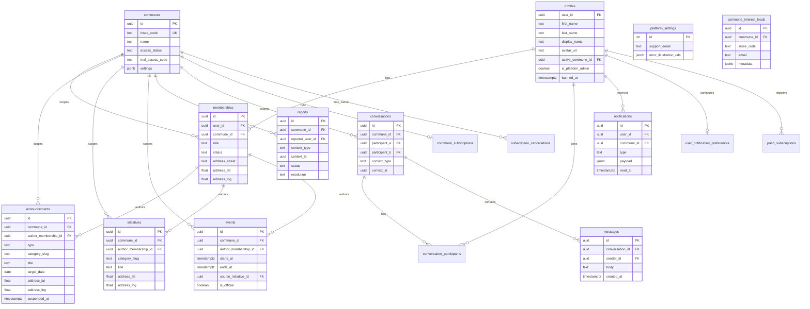

# Database ERD — Tous Voisins

Diagramme de référence du schéma Postgres (Supabase). Les policies RLS ne sont pas représentées ici.

## Glossaire rapide

| Table | Rôle |
| --- | --- |
| `profiles` | Extension du compte Supabase Auth (profil, commune active, flags admin) |
| `communes` | Tenant — une commune adhérente ou en essai |
| `memberships` | Lien user ↔ commune avec rôle (`member`, `staff`, `mayor`) et adresse |
| `announcements` | Annonces voisins (demande / offre / don) |
| `initiatives` | Projets collectifs |
| `events` | Événements communaux (optionnellement liés à une initiative) |
| `conversations` / `messages` | Messagerie contextuelle (annonce, initiative, événement) |
| `reports` | Signalements modération |
| `notifications` | Notifications in-app (insert via triggers, pas de policy INSERT client) |
| `platform_settings` | Réglages globaux plateforme (email support, illustrations erreur) |
| `commune_interest_leads` | Leads pré-inscription (commune non disponible) |
